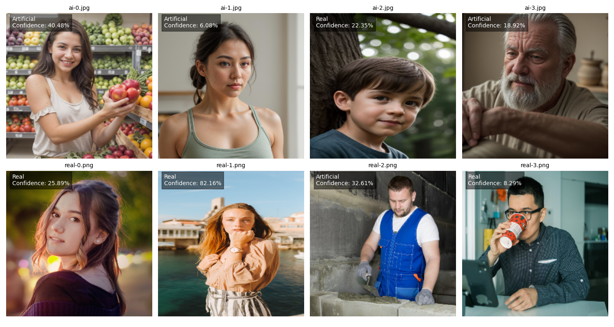

This project is about Artificial Image Detection or AID for short.

I don't expect much to come of this, as I'm just messing around with CNNs and training, I was curious how well it'd be able to detect things.

I have found however, that it is Very possible to detect an AI image, even with a very basic and minimal setup I was able to train a model that could detect AI Images 
with around a 75% accuracy, of course, this field is VERY variable, and I've focused training on images of people.

All real images sourced from the following sites, I used only the free for use images:
www.pexels.com
www.pixabay.com
www.istockphoto.com
www.unsplash.com

AI images generated from various generators, primarily www.getimg.ai and www.perchance.org/ai-photo-generator

This project was put together in about 4 hours or so, I think that, with enough samples, a fairly robust ai image detecting ai could be built.